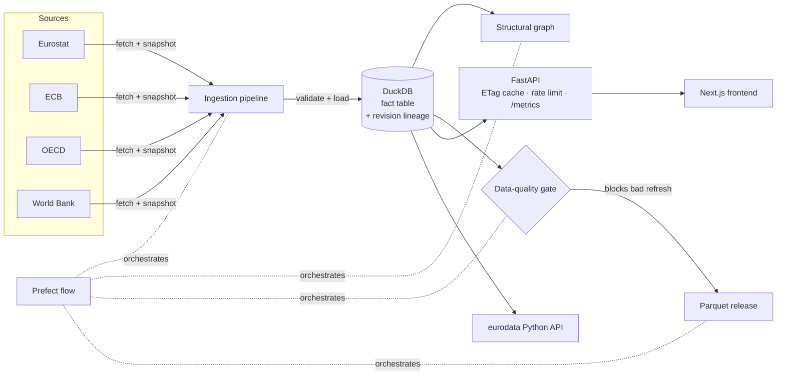

# Eurodata

[](https://github.com/ASRIDK/eurodata/actions/workflows/ci.yml)
[](https://github.com/ASRIDK/eurodata/actions/workflows/data-refresh.yml)
[](https://github.com/ASRIDK/eurodata/actions/workflows/data-refresh.yml)

Open-source **European data intelligence platform**: a Python-importable dataset,
a reproducible ingestion pipeline, and an exploratory Streamlit dashboard for
studying Europe through open data — economy, demographics, digital, energy &
climate, AI & technology, plus a curated **event layer** for before/after
analysis.

- **Facts** — ~32k current official statistics (32 indicators × 49 countries ×
  2000–2025; ~72k rows including revision history) in a single DuckDB fact
  table with revision lineage and per-record source.
- **Events** — 43 curated, dated European events (memberships, crises, policy
  milestones) with primary-source URLs, for event studies.
- **Graph** — countries, indicators, sources and blocs as a NetworkX-ready
  structural graph.
- **Provenance-first** — every indicator has a definition, license and an
  explicit *proxy* flag when the series is a stand-in for the official concept.

## Architecture



The whole refresh — ingest → build graph → **data-quality gate** → release — is
one orchestrated [Prefect](https://prefect.io) flow (`flows/ingestion.py`) that
runs weekly in CI. A blocking quality contract fails the run instead of
publishing a broken release.

## Quickstart

```bash
python -m venv .venv && source .venv/bin/activate
pip install -e .
python scripts/init_db.py        # create + seed data/eurodata.duckdb
python scripts/run_ingestion.py  # fetch World Bank + Eurostat (a few minutes)
streamlit run app/streamlit_app.py
```

## Python API

```python
import eurodata as ed

ed.countries()                       # 50 European countries
ed.blocs()                           # EU, Eurozone, Schengen, EFTA, EEA, NATO
ed.domains(); ed.indicators()        # catalog with definitions + proxy flags
ed.search_indicators("AI")

ed.series(country="FRA", indicator="GDP")            # tidy DataFrame
ed.series(indicator="Median Age", bloc="EU")         # bloc filter
ed.series(country="FRA", indicator="Inflation (HICP, monthly)")  # monthly rows
ed.series(indicator="GDP", rebase=2000)              # index: 2000 = 100
ed.series(indicator="GDP", yoy=True)                 # % change y/y
ed.compare(["FRA", "DEU", "ITA"], "Unemployment Rate")
ed.latest("GDP per capita")
ed.coverage()                        # rows/countries/years per indicator

# Event layer
ed.events(country="UKR", since="2020-01-01")
ed.events(event_type="ai_regulation")
ed.event_study(indicator="Inflation (HICP)",
               event_code="energy-crisis-2021", window_years=3)

# Correlations (per-country Pearson with p-values + Fisher-z 95% CIs;
# correlation ≠ causation)
ed.correlate("Internet Users %", "GDP per capita")
ed.lagged_correlation("R&D Expenditure (% GDP)", "GDP per capita", lag=2)

# Convergence (do poorer countries/regions catch up? β- and σ-convergence)
c = ed.convergence("GDP per capita", bloc="EU")   # scatter: growth vs initial level
c.attrs["beta"]         # regression: coefficient (<0 = converging), speed, half_life
c.attrs["sigma"]        # per-year dispersion of log levels
c.attrs["sigma_trend"]  # is dispersion shrinking over time?

# Escape hatches
ed.query("SELECT * FROM statistic_best LIMIT 10")    # raw SQL → DataFrame
db = ed.open("path/to/other.duckdb")                 # custom database
```

Unknown names raise `ed.EuroDataLookupError` with did-you-mean suggestions.

## Data sources & licensing

| Source | Used for | License |
|--------|----------|---------|
| **Eurostat** (JSON API) | Median age, HICP inflation (annual + monthly), quarterly GDP growth, AI adoption, ICT specialists | CC BY 4.0 |
| **World Bank** | 22 indicator series (fallback + global coverage) | CC BY 4.0 |
| **ECB** (SDMX CSV) | monthly long-term interest rates (10y), exchange rates vs EUR | ECB reuse policy (attribution) |
| **OECD** (SDMX CSV) | monthly unemployment rate (OECD members) | OECD terms (attribution) |
| **eurodata curated** | event layer (each event cites its primary source) | CC BY 4.0 compilation |

When several sources provide a series, `statistic_best` keeps the one with the
highest `source.reliability_score` (Eurostat and ECB rank above OECD and World
Bank). Three indicators are **proxies** and flagged as such in the catalog
and dashboard: Inflation (WB CPI vs HICP), Broadband (subscriptions vs
coverage), Government Debt (central vs general government).

See [docs/data-dictionary.md](docs/data-dictionary.md),
[docs/events.md](docs/events.md) and
[docs/contributing-sources.md](docs/contributing-sources.md).

## Reproducibility

The database is fully rebuildable from scripts: `init_db.py` (schema + seeds) →
`run_ingestion.py` (fetch with timeouts/retries; failures land in
`ingestion_run` / `ingestion_error`, never silently swallowed; Eurostat raw
responses are snapshotted with sha256 under `data/raw/` — World Bank data comes
through `wbgapi`, which does not expose raw payloads) →
`build_graph.py` → `make_release.py` (Parquet export of redistributable data).

```bash
PYTHONPATH=src python -m pytest -q   # test suite, no network needed
```

## Orchestrated pipeline & data-quality gate

The scripts above also run as a single observable [Prefect](https://prefect.io)
flow with per-source retries and a materialization graph:

```bash
pip install -e ".[dev]"          # includes Prefect
python scripts/init_db.py
python -m flows.ingestion        # ingest → build graph → quality gate → release
python -m flows.ingestion --no-release   # skip the Parquet export
```

Before any release is published, the flow runs a battery of **data contracts**
(`eurodata.ingest.quality`); a broken *ERROR*-severity contract fails the run so
a bad refresh never ships:

| Contract | Checks |
|----------|--------|
| `row_count` | fact table isn't near-empty |
| `referential_integrity` | every fact resolves to a real geography / indicator / source |
| `value_finiteness` | no NaN/±Inf values reached the table |
| `freshness` | no indicator staler than *N* years (warn vs. error thresholds) |
| `ingestion_runs` | no source's latest run failed |
| `nuts_rollup` | additive indicators' regions sum to the national total (cross-level reconciliation) |

```python
from eurodata.db import connect
from eurodata.ingest.quality import run_quality_checks
print(run_quality_checks(connect(read_only=True)).summary())
```

`.github/workflows/data-refresh.yml` runs the whole flow weekly, uploads the
Parquet release as an artifact, and updates the **data** freshness badge above.

## Web API & observability

A FastAPI service (`web/backend`) wraps the Python API 1:1 — self-documenting
OpenAPI at **`/docs`**, per-endpoint `ETag`/`Cache-Control` (304s on unchanged
data), and a token-bucket rate limiter on the chat route.

```bash
PYTHONPATH=src:. uvicorn web.backend.main:app --port 8000
```

- `GET /api/health` — liveness  ·  `GET /api/ready` — readiness (503 if the DB is unreachable)
- `GET /metrics` — Prometheus request counts + per-route latency
- every response carries `X-Response-Time-ms`; one structured JSON access log per request
